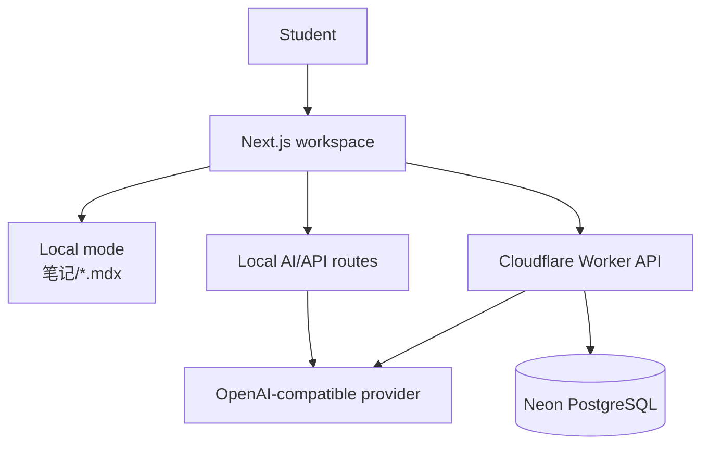

<a id="readme-top"></a>

<div align="center">

# YYNotes

**A bilingual AI workspace for turning source material into structured Markdown/MDX notes.**

从文档、课件和粘贴内容生成中文优先、英文对照的可编辑学习笔记。

[Live Demo](https://yynotes.pages.dev) · [Report Bug](https://github.com/YanYihann/YYnotes/issues/new?labels=bug) · [Request Feature](https://github.com/YanYihann/YYnotes/issues/new?labels=enhancement)

[](https://nextjs.org/)
[](https://react.dev/)
[](https://www.cloudflare.com/)
[](#license)

</div>

## Overview

YYNotes is a general-purpose study workspace for transforming raw learning material into structured bilingual notes. It accepts pasted text and supported document uploads, generates Chinese-first and English-version content, preserves formulas and code, and stores the result as editable Markdown/MDX.

The project supports two complementary modes:

- **Local mode:** notes are read from and written to `笔记/*.mdx` through Next.js API routes.
- **Cloud mode:** users authenticate and manage notes and folders through a Cloudflare Worker backed by Neon PostgreSQL.

## Highlights

| Area | Capability |
| --- | --- |
| Generation | Chinese-first and English-version notes from source material |
| File handling | Text, Markdown, DOCX, PPTX, screenshots, and pasted content workflows |
| Rich rendering | Markdown/MDX, tables, code highlighting, raw HTML, and KaTeX formulas |
| Study assistant | Page-aware Q&A with selected-text context and question history |
| Editing | Rendered-note editing, metadata updates, annotations, and image paste |
| Organization | Folders, local notes, cloud notes, and user-isolated CRUD |
| Authentication | Email/password and Google sign-in in cloud mode |
| Delivery | Cloudflare Pages frontend, Worker API, and GitHub Actions deployment |

## Architecture



## Quick start

### Prerequisites

- Node.js 20 or newer
- npm 10 or newer
- An OpenAI-compatible API key for generation and assistant features
- Optional for cloud mode: Cloudflare account and Neon database

### Install and run

```bash
git clone https://github.com/YanYihann/YYnotes.git
cd YYnotes
npm install
npm run dev
```

Open `http://localhost:3000`.

Create `.env.local` for AI and optional cloud features:

```env
OPENAI_API_KEY=your_key
OPENAI_MODEL=gpt-4.1-mini
OPENAI_BASE_URL=https://api.openai.com/v1

# Optional cloud mode
NEXT_PUBLIC_NOTES_API_BASE=https://your-worker-domain
NEXT_PUBLIC_GOOGLE_CLIENT_ID=your-google-oauth-client-id
```

If `NEXT_PUBLIC_NOTES_API_BASE` is absent, cloud sign-in and cloud notes are disabled; local notes continue to work.

## Authoring workflow

1. Paste content or upload supported source material.
2. Generate a structured note using the rules in `prompt.md`.
3. Review the Chinese and English sections for alignment.
4. Edit the rendered note or its metadata.
5. Ask the note-aware assistant questions using page or selected-text context.
6. Save locally as MDX or synchronize through cloud mode.

Important authoring rules:

- `prompt.md` is the source of truth for generation behavior.
- `public/prompt.md` is the synchronized public copy.
- Formula content must remain compatible with `remark-math` and `rehype-katex`.
- Notes use `.mdx` so reusable components can be introduced later.

## Main routes

| Route | Purpose |
| --- | --- |
| `/` | Note-generation entry |
| `/auth` | Email and Google authentication |
| `/notes` | Notes index |
| `/notes/[slug]` | Local note viewer/editor |
| `/notes/cloud?slug=...` | Cloud note viewer/editor |
| `/demos/sign-in` | Authentication UI demonstration |

## API overview

Local Next.js routes:

```text
POST   /api/note-generator      Generate and save an MDX note
POST   /api/notes-assistant     Answer with current-note context
PATCH  /api/notes?slug=...      Update local note metadata/content
DELETE /api/notes?slug=...      Delete a local note
```

Cloud Worker routes:

```text
/auth/register  /auth/login  /auth/google  /auth/me
/notes          /notes/:slug /notes/generate
/folders        /folders/:id
/health
```

Protected cloud endpoints require `Authorization: Bearer <token>`.

## Development commands

```bash
npm run dev
npm run typecheck
npm run lint
npm run build
```

## Deployment

The repository contains two GitHub Actions workflows:

- `.github/workflows/deploy-pages.yml` builds the frontend and deploys to Cloudflare Pages from `master`.
- `.github/workflows/deploy-worker.yml` deploys the Worker API with retry handling for transient failures.

Required repository secrets:

- `CLOUDFLARE_API_TOKEN`
- `CLOUDFLARE_ACCOUNT_ID`

Common variables:

- `CLOUDFLARE_PAGES_PROJECT_NAME`
- `NEXT_PUBLIC_NOTES_API_BASE`
- `NEXT_PUBLIC_GOOGLE_CLIENT_ID`
- `NEXT_PUBLIC_NOTES_WRITE_KEY` when enabled by the deployment

Manual Worker setup:

```bash
cd cloud/neon-notes-worker
npm install
wrangler secret put DATABASE_URL
wrangler secret put OPENAI_API_KEY
wrangler secret put AUTH_SECRET
wrangler secret put GOOGLE_CLIENT_ID
npm run deploy
```

## Repository map

```text
YYnotes/
├── app/                       # Next.js pages and local API routes
├── components/                # Interface and feature components
├── lib/                       # Content, auth, AI, and shared utilities
├── 笔记/                      # Local Markdown/MDX notes
├── cloud/neon-notes-worker/   # Worker API and Neon schema
├── functions/                 # Pages Functions examples
├── prompt.md                  # Note-generation rules
└── .github/workflows/         # Pages and Worker delivery
```

## Privacy and security

- Uploaded material and note context may be sent to the configured AI provider. Only process content you are authorized to use.
- Never expose API keys, database URLs, OAuth secrets, or authentication secrets through browser variables or Git history.
- Local notes remain in `笔记/`; cloud notes follow the retention, access, and deletion rules of the deployed Worker and database.
- Before a public deployment, review upload limits, file parsing, account deletion, database backups, and provider retention settings.

## Roadmap

- [x] Bilingual note generation and KaTeX-compatible rendering
- [x] Local and cloud note workflows
- [x] Email/password and Google authentication
- [x] Folder management and user-isolated cloud CRUD
- [x] Context-aware study assistant and rendered-note editing
- [ ] Complete speech-to-text processing for voice attachments
- [ ] Add reusable MDX blocks for definitions, examples, warnings, and practice
- [ ] Add a visual documentation and screenshot gallery

## Contributing

Open an issue with clear reproduction steps or the proposed learning workflow. Keep pull requests focused and describe changes to prompts, data formats, API behavior, or deployment requirements.

## License

No `LICENSE` file is currently included. Add an explicit license before treating this repository as open-source software or redistributing it.

## Acknowledgments

README structure is inspired by [Best-README-Template](https://github.com/othneildrew/Best-README-Template) and the examples curated in [awesome-readme](https://github.com/matiassingers/awesome-readme).

<p align="right"><a href="#readme-top">Back to top</a></p>


